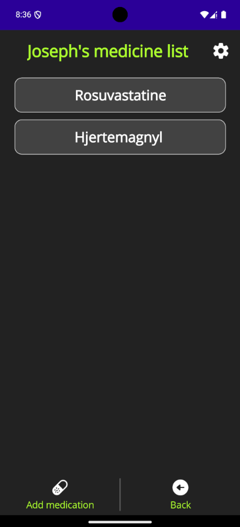

# Medicine Reminder - MAUI Android App

**Medicine Reminder** is a **.NET MAUI Android application** designed to help users organize and keep track of their medications.  
The app provides a simple and efficient way to receive reminders at the right time.

---

### 🎯 Purpose
- Provide a **practical solution** for forgetting or mismanaging daily medications.  
- Supports up to **10 different users**, useful for families.

---

### ✨ Features
- **User Management**: add, delete, and edit usernames (up to 10 users)  
- **Medicine Management**:  
  - Add medicine with name, dosage (pill or mg), days of the week, and time  
  - Edit or delete medicine  
- **Notifications**: local Android notifications on selected days and times  
- Simple and user-friendly interface  

---

### 🛠️ Technologies
- .NET MAUI  
- C#  
- SQLite (local data storage)  
- Android Notifications (Not done yet)  
- MVVM architecture  

---

### 🚀 Getting Started
1. Clone this repository:  
   ```bash
   git clone https://github.com/YOUR-USERNAME/Medicine-Reminder-MAUI-Android-App.git
   ```


###Screenshots




